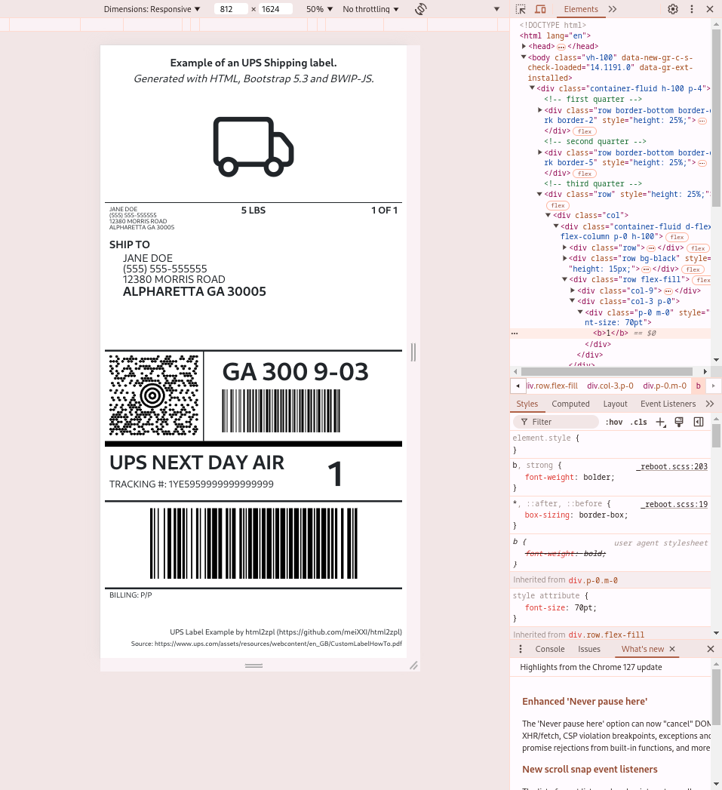

# ZplBox
**Use your favorite web framework to design ZPL Labels far more straightforward and sophisticated than native ZPL will ever can do!**

## Features
* Conversion HTML to ZPL
* Conversion PDF to ZPL

ZplBox is based on an embedded Chromium, rendering your web content as PNG. So, you can leverage the full web technology stack to create your labels.
You can submit your web content via a file or by referencing it using an external URL (preferred).

Once rendered as PNG, your content will be converted into a monochrome image and encoded in a ZPL native ASCII hexadecimal string.
The final ZPL label consists of only the ASCII hexadecimal string embedded in a Graphic Field (^GF) and will sent back in the response.

This approach will allow you new possibilities, which are nearly impossible with native ZPL, including:
* **Images:** Embed and scale images flexibly using default web technologies
* **Fonts:** You can use any fonts supported by web frameworks
* **Text / Typography:** You can use any methods you use in web design.
* ...


## Quick Start
### 1. Start ZplBox as Docker container:
```bash
docker run -p 8080:8080 ghcr.io/meixxi/zplbox:latest
```
### 2. Creation of a test label:
This example reference the test label 'ups-example.html', pre-installed in the docker container. More about test labels you can find below.
```bash
curl --request POST \
     --url http://localhost:8080/v1/html2zpl \
     --header 'content-type: application/json' \
     --data '{ "url":"http://localhost:8080/labels/ups-example.html", "widthPts":812, "heightPts":1624 }'
```

### 3. Verify the output
Copy the generated ZPL Code to https://labelary.com/viewer.html to get a visual representation.  
**NOTE: Adjust label size to 4 x 8 inches for this label on https://labelary.com/viewer.html**

## Test Labels
The ZplBox project comes with a set of pre-installed example labels.

### UPS Shipping Label Example (HTML)
Reference: https://www.ups.com/assets/resources/webcontent/en_GB/CustomLabelHowTo.pdf

Target Label Size : 4 x 8 inches  
Resolution Printer: 8dpmm (203 dpi)  
Size Label in Pixes: 812 x 1624	 pixels

Project Path: [src/main/resources/static/labels/ups-example.html](src/main/resources/static/labels/ups-example.html)  
Container URL: http://localhost:8080/labels/ups-example.html

```bash
curl --request POST \
     --url http://localhost:8080/v1/html2zpl \
     --header 'content-type: application/json' \
     --data '{ "url":"http://localhost:8080/labels/ups-example.html", "widthPts":812, "heightPts":1624 }'
```

**NOTE: Adjust label size to 4 x 8 inches for this label on https://labelary.com/viewer.html**


*Google Chrome: Developer tools -> Custom Viewport Size (here: 812 x 1624 pixels - scale: 50 %)*

### Example Shipping Label (PDF)
Source: https://doc.phomemo.com/Labels-Sample.pdf

Target Label Size : 4 x 6 inches  
Resolution Printer: 8dpmm (203 dpi)  

Project Path: [src/main/resources/static/labels/test-label-2.pdf](src/main/resources/static/labels/test-label-2.pdf)  
Container URL: http://localhost:8080/labels/test-label-2.pdf

```bash
curl --request POST \
     --url http://localhost:8080/v1/pdf2zpl \
     --header 'content-type: application/json' \
     --data '{ "url":"http://localhost:8080/labels/test-label-2.pdf", "dotsPerInch":203 }'
```

**NOTE: Adjust label size to 4 x 6 inches for this label on https://labelary.com/viewer.html**

## API Reference:
You can find the swagger.yml file in the project root. The visual representation of the file you can
find **[here](https://petstore.swagger.io/?url=https://raw.githubusercontent.com/meiXXI/zplbox/main/swagger.yml)**.


## Advanced

### Post base64 encoded HTML files
You can submit a file to ZplBox by encoding it to base64 as below:

```bash
curl --request POST \
     --url http://localhost:8080/v1/html2zpl \
     --header 'content-type: application/json' \
     --data '{ "dataBase64":"'$(base64 -w 0 my-file.html)'", "widthPts":812, "heightPts":1624 }'
```

## Logo

